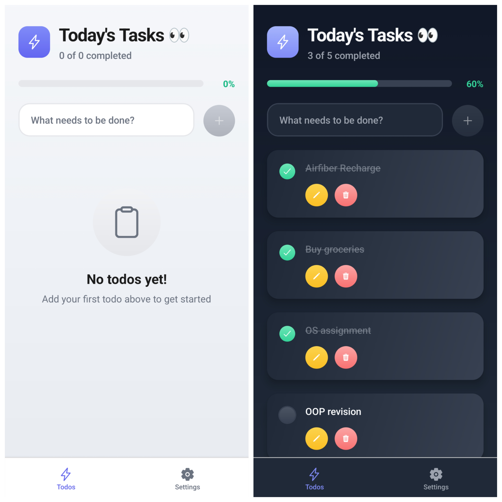
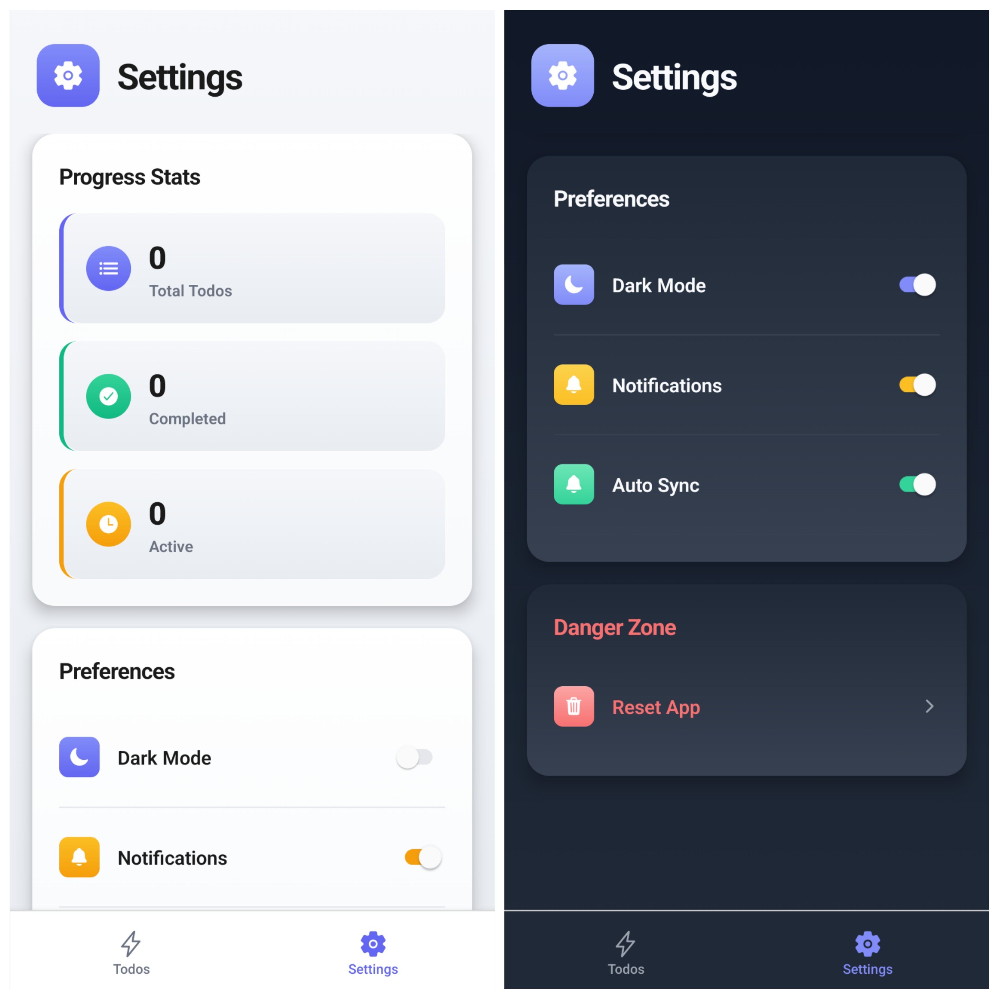

<h1 align="center">
   
  TODO APP 📝
   
</h1>

  

<h3 align="center">
An intuitive and efficient mobile application for managing your daily tasks, built with modern technologies.
</h3>

---

  

  

---

## 🌟 Features

- ➕ **Add Tasks** – Easily add new tasks to your list.
- 📝 **Edit Tasks** – Modify existing tasks with a simple tap.
- ❌ **Delete Tasks** – Remove individual tasks as needed.
- 🧹 **Delete All Tasks** – Clear the entire list with one click.
- ✅ **Toggle Completion** – Mark tasks as complete or incomplete.
- 📊 **Completion Indicator** – View the percentage of completed tasks in real time.
- 🌗 **Theme Toggle** – Switch between light and dark modes for better accessibility.

---

## 🛠 Tech Stack & Architecture

- **Frontend**: React Native with Expo – for a fast and responsive mobile experience.
- **Backend**: [Convex](https://www.convex.dev) – Handles business logic and API endpoints.
- **Database**: Convex – Built-in real-time NoSQL database.
- **Styling**: CSS
- **State Management**: React Context API